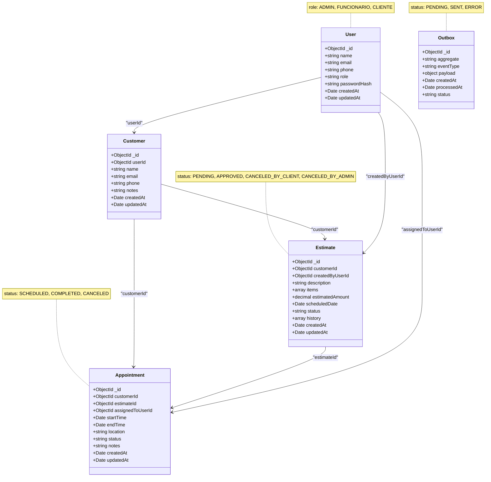

```mermaid
classDiagram
    class User {
        +ObjectId _id
        +string name
        +string email
        +string phone
        +string role
        +string passwordHash
        +Date createdAt
        +Date updatedAt
    }

    class Customer {
        +ObjectId _id
        +ObjectId userId
        +string name
        +string email
        +string phone
        +string notes
        +Date createdAt
        +Date updatedAt
    }

    class Estimate {
        +ObjectId _id
        +ObjectId customerId
        +ObjectId createdByUserId
        +string description
        +array items
        +decimal estimatedAmount
        +Date scheduledDate
        +string status
        +array history
        +Date createdAt
        +Date updatedAt
    }

    class Appointment {
        +ObjectId _id
        +ObjectId customerId
        +ObjectId estimateId
        +ObjectId assignedToUserId
        +Date startTime
        +Date endTime
        +string location
        +string status
        +string notes
        +Date createdAt
        +Date updatedAt
    }

    class Outbox {
        +ObjectId _id
        +string aggregate
        +string eventType
        +object payload
        +Date createdAt
        +Date processedAt
        +string status
    }

    User --> Customer : "userId"
    Customer --> Estimate : "customerId"
    Customer --> Appointment : "customerId"
    Estimate --> Appointment : "estimateId"
    User --> Estimate : "createdByUserId"
    User --> Appointment : "assignedToUserId"

    note for User "role: ADMIN, FUNCIONARIO, CLIENTE"
    note for Estimate "status: PENDING, APPROVED, CANCELED_BY_CLIENT, CANCELED_BY_ADMIN"
    note for Appointment "status: SCHEDULED, COMPLETED, CANCELED"
    note for Outbox "status: PENDING, SENT, ERROR"
```